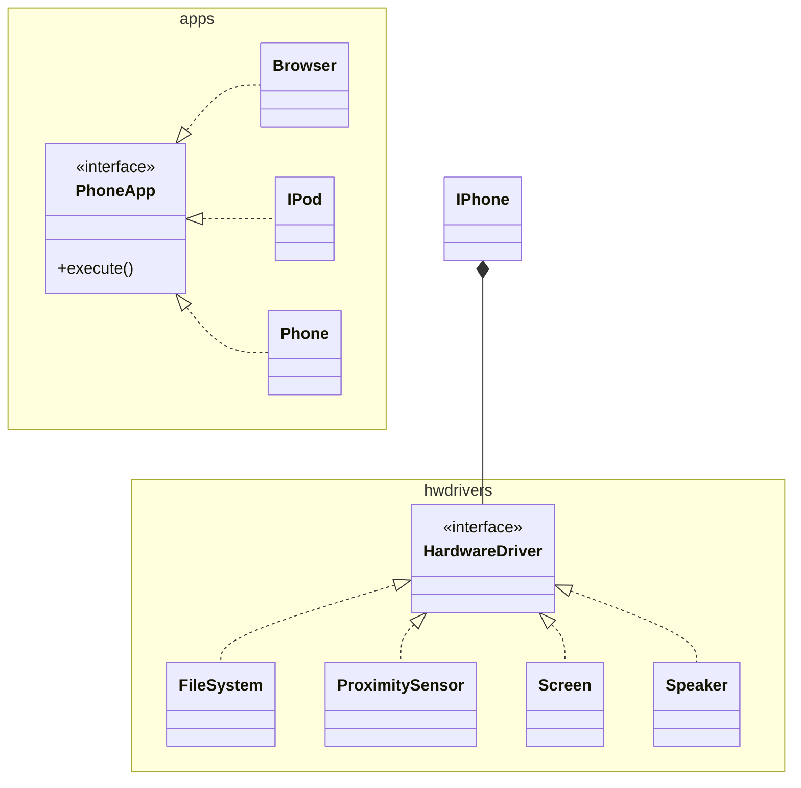

# dio-trilha-java-basico
Projeto para a entrega dos desafios do Curso "Santander 2024 - Backend com Java"

Os desafios de código estão abaixo.

## Siulador de Conta de Banco no Terminal
```
org.juanpla.contabanco.ContaTerminal
```
##Controle de Fluxo
```
org.juanpla.desafiocontrolefluxo.Contador
```
## Classes Java para IPhone
```
org.juanpla.iphone.IPhone
```


